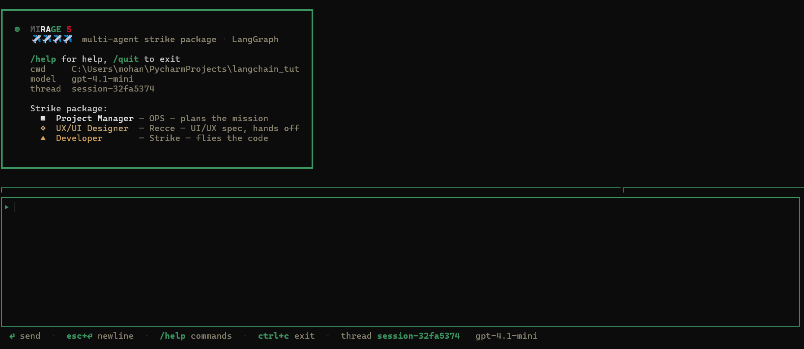

# MIRAGE  CLI

Mirage is an open-source coding agent CLI, similar in spirit to Claude-style terminal agents, built on top of **LangChain** and **LangGraph**.




It runs a single primary runtime agent:
- `Build` (implementation and execution)


---

## Features

- Single-agent LangGraph runtime loop
- Interactive chat mode with a bordered prompt input box
- Non-interactive single-task mode
- Thread-aware **persisted** memory (SQLite checkpointer under `~/.mirage/sessions.db`)
- Multi-provider models (**OpenAI**, **Anthropic**, **Google Gemini**) via LangChain `init_chat_model`
- Terminal **model form** for API key + base URL when configuring `/model`
- Runtime modes with policy gates (`build` = allow, `plan` = ask-before `edit`/`bash`)
- Session index (`~/.mirage/sessions.json`) — list, switch, rename, delete sessions from chat or CLI
- Slash commands for session + model control (`/help`, `/sessions`, `/session`, `/model`, …)
- Deduplicated Claude-style core toolset for filesystem, shell, search, git, web, notebook, and MCP descriptor discovery
- Auto project scaffold creation for `.mirage/agents` and `.mirage/commands` when running Mirage in a project
- Installable package with console scripts:
  - `mirage`
  - `mirage-cli`

## Mirage compatibility mode

Mirage now includes a unified compatibility surface so teams can adopt Mirage with familiar workflows.

- Command aliases and parity-style commands:
  - `mirage session ...` (alias for `sessions`)
  - `mirage auth login|list|logout`
  - `mirage mcp add|list|delete|disable|auth|logout|debug`
  - `mirage export`, `mirage import`, `mirage stats`
  - `mirage serve`, `mirage web`, `mirage attach`
- `run` supports parity flags such as `--session`, `--continue`, `--fork`, `--file`, `--format`, `--title`, `--agent`, and `--attach`.
- Slash command parity additions:
  - `/undo`, `/redo`, `/compact`, `/summarize`, `/details`, `/thinking`, `/themes`, `/editor`, `/export`, `/share`, `/unshare`, `/mode`, `/agent`
- Project compatibility files:
  - `mirage.json` model defaults are read for provider/model hints.
  - `.mirage/commands/*.md` and `.mirage/agents/*.md` are supported.
  - custom command frontmatter (`agent`, `model`, `subtask`) is honored at runtime.

Detailed command mapping is documented in `docs/mirage_parity_matrix.md`.

## State Architecture

Mirage uses a production-oriented state pattern inspired by Claude CLI:

- Runtime chat session state is centralized in a typed store (`RuntimeSessionStore`) with immutable updates, invariant validation, and a single derive/on-change chokepoint.
- Provider/model changes automatically rebuild the compiled graph in one place (instead of scattered command handlers).
- Session identity/provider/model updates are synchronized to the persistent session index through a single state-change hook.
- Runtime flow is a direct `START -> Build -> END` LangGraph topology.

Compatibility guarantees:
- Existing `~/.mirage/sessions.json` metadata remains valid.
- Existing `~/.mirage/sessions.db` checkpoint threads remain valid.
- LangGraph state contract remains stable (`messages`).

---

## Tool catalog (core)

Mirage now ships a canonical, deduplicated core tool registry under `src/tools/`.

- **Read-only tools** (available to Build):
  - filesystem: `list_directory`, `read_file`
  - search: `glob_search`, `ripgrep_search`
  - git: `git_status`, `git_diff`, `git_log`, `git_current_branch`
  - web: `web_fetch`, `web_search`
  - notebook: `read_notebook`
  - mcp descriptors: `list_mcp_servers`, `list_mcp_tools`, `read_mcp_tool_schema`
- **Build agent extras**:
  - filesystem write: `write_file`, `edit_file`
  - execution: `run_shell_command`
  - notebook edit: `edit_notebook_cell`
  - MCP call placeholder: `call_mcp_tool`

Deduplication is enforced at startup. If duplicate tool ids are exported, Mirage fails fast.

Intentionally skipped in this pass:
- team/task orchestration-style tooling
- scheduling/cron and remote-trigger style tooling

---

## Requirements

- Python `>=3.11`
- At least one LLM provider credential (environment variable **or** saved in `~/.mirage/config.json`):
  - OpenAI: `OPENAI_API_KEY`
  - Anthropic: `ANTHROPIC_API_KEY`
  - Google Gemini: `GOOGLE_API_KEY` or `GEMINI_API_KEY`

Optional tools:
- `uv` (recommended for fast dependency management)
- `pipx` or `uvx` (for isolated CLI execution)

---

## Project layout

```text
.
├─ main.py                  # Backward-compatible shim
├─ pyproject.toml
├─ scratch_test.py          # smoke tests
└─ src/
   ├─ __main__.py           # supports python -m and uv run .\src\
   ├─ config.py
   ├─ config_store.py      # ~/.mirage/config.json
   ├─ llm/
   │  ├─ catalog.py        # curated model ids
   │  ├─ factory.py        # init_chat_model wrapper
   │  └─ spec.py
   ├─ sessions/
   │  └─ store.py          # sessions.json index + checkpoint deletes
   ├─ theme.py
   ├─ tools/
   │  ├─ catalog.py
   │  ├─ filesystem.py
   │  ├─ shell.py
   │  ├─ search.py
   │  ├─ git_tools.py
   │  ├─ web_tools.py
   │  ├─ notebook_tools.py
   │  └─ mcp_tools.py
   ├─ agents/
   │  ├─ prompts.py
   │  ├─ state.py
   │  ├─ supervisor.py
   │  ├─ graph.py
   │  └─ ...
   └─ cli/
      ├─ app.py
      ├─ model_form.py      # prompt_toolkit configuration form
      ├─ session.py
      ├─ input_box.py
      └─ render.py
```

---

## Quick start (recommended: uv)

```bash
# from repo root
uv pip install -e . --python ".venv/Scripts/python.exe"
```

Set your API key:

```bash
# PowerShell
$env:OPENAI_API_KEY="your-key-here"
```

Run:

```bash
mirage --help
mirage chat
```

---

## Installation options

### 1) pip (from source)

```bash
python -m pip install -e .
```

Then:

```bash
mirage --help
```

### 2) uv (from source)

```bash
uv pip install -e . --python ".venv/Scripts/python.exe"
```

Then:

```bash
mirage --help
```

### 3) pipx (isolated CLI install)

```bash
pipx install .
```

Then:

```bash
mirage --help
```

### 4) uvx (ephemeral run)

```bash
uvx --from . mirage --help
uvx --from . mirage chat
```

---

## Running without installing

You can still run from source directly:

```bash
python -m src --help
python main.py --help
uv run .\src\ --help
```

> Installed entrypoints (`mirage` / `mirage-cli` via `mirage_cli.py`) default to **`chat`** when no subcommand is given.

---

## CLI usage

### Interactive mode

```bash
mirage chat
```

Options:

- `--thread-id`, `-t` — LangGraph thread id (conversation key)
- `--session-id`, `-s` — resume by thread id listed in `~/.mirage/sessions.json`
- `--model`, `-m` — model id (free-form; curated lists are helpers only)
- `--provider`, `-p` — `openai` | `anthropic` | `google`

On startup (TTY only), Mirage may prompt to **resume the most recent saved session**.

Examples:

```bash
mirage chat --provider anthropic --model claude-sonnet-4-5
mirage chat --session-id session-a1b2c3d4
```

### One-shot mode

```bash
mirage run "build a hello world FastAPI app"
```

Options:

- `--thread-id` (default: `mirage-session-1`)
- `--model`, `-m`
- `--provider`, `-p`

Extended compatibility flags:

- `--continue`, `-c` — continue most recent saved session
- `--session`, `-s` — run against a specific session id
- `--fork` — create a new thread id before running
- `--file`, `-f` — attach one or more file paths as prompt context
- `--format` — output format (`default` or `json`)
- `--title` — create/update session title metadata
- `--agent` — runtime mode/profile hint (for example `build` or `plan`)
- `--attach` — compatibility flag for remote-style execution flow

### Terminal commands (outside chat)

```bash
mirage models list [--provider openai|anthropic|google]

mirage config show
mirage config set-key <provider> <api-key>
mirage config set-url <provider> <url>
mirage config set-default <provider> <model-id>

mirage sessions list
mirage sessions new [name]
mirage sessions delete <thread-id-or-index>
```

## Command reference

This section explains every CLI command currently supported by Mirage.

### `mirage` / `mirage chat`

Start interactive TUI chat mode.

- Purpose: conversational coding session with slash commands and persistent thread memory.
- Common flags:
  - `--thread-id`, `-t`
  - `--session-id`, `-s`
  - `--provider`, `-p`
  - `--model`, `-m`

Examples:

```bash
mirage
mirage chat --provider openai --model gpt-4.1-mini
mirage chat --session-id session-a1b2c3d4
```

### `mirage run`

Run a single prompt non-interactively.

Examples:

```bash
mirage run "summarize this repo"
mirage run --continue "continue previous task"
mirage run --session session-a1b2c3d4 --format json "generate changelog"
```

### `mirage models`

List curated model ids.

Subcommands and forms:

- `mirage models`
- `mirage models <provider>`
- `mirage models list --provider <provider>`

Examples:

```bash
mirage models
mirage models anthropic
mirage models list --provider google
```

### `mirage config`

Manage stored provider credentials/defaults.

- `mirage config show`
- `mirage config set-key <provider> <api-key>`
- `mirage config set-url <provider> <url>`
- `mirage config set-default <provider> <model-id>`

Example:

```bash
mirage config set-key openai sk-...
mirage config set-default openai gpt-4.1-mini
```

### `mirage sessions` / `mirage session`

Manage saved sessions (`session` is an alias of `sessions`).

- `list`
- `new [name]`
- `delete <thread-id-or-index>`

Examples:

```bash
mirage sessions list
mirage session new "Refactor pass"
mirage sessions delete 1
```

### `mirage auth`

Credential-centric provider commands.

- `mirage auth login --provider <provider> --key <api-key>`
- `mirage auth list` (alias: `mirage auth ls`)
- `mirage auth logout <provider>`

### `mirage mcp`

MCP compatibility command group.

- `mirage mcp list` (alias: `ls`)
- `mirage mcp add --name <name> [--command <cmd> --arg <value> ... | --url <url>] [--scope user|project]`
- `mirage mcp delete <name> [--scope user|project]`
- `mirage mcp disable <name> [--scope user|project]`
- `mirage mcp auth [name]`
- `mirage mcp logout <name>`
- `mirage mcp debug <name>`

Examples:

```bash
mirage mcp add --name github --command npx --arg -y --arg @modelcontextprotocol/server-github --scope user
mirage mcp add --name linear --url https://mcp.linear.app --scope project
mirage mcp delete linear --scope project
mirage mcp disable github --scope project
mirage mcp list
```

### `mirage export`

Export session metadata (JSON) to the current project directory.

Examples:

```bash
mirage export
mirage export session-a1b2c3d4
```

### `mirage import`

Import session metadata from JSON.

Example:

```bash
mirage import .\mirage-session-session-a1b2c3d4.json
```

### `mirage stats`

Print local session usage summary by provider.

Example:

```bash
mirage stats --days 7
```

### `mirage serve`

Run Mirage as a minimal headless HTTP service.

See detailed docs: [Serve command guide](docs/serve.md).

Quick example:

```bash
mirage serve --hostname 127.0.0.1 --port 4096
```

### `mirage web`

Start the same headless server as `serve` and open a browser to a health endpoint.

Example:

```bash
mirage web --port 4096
```

### `mirage attach`

Attach-compatibility command that currently opens local chat while recording target URL intent.

Example:

```bash
mirage attach http://localhost:4096
```

---

## Slash commands (inside chat)

- `/help` — cockpit help
- `/clear` — clear terminal and repaint welcome panel
- `/new [name]`, `/reset` — new session (new thread id + index entry)
- `/sessions` — table of saved sessions
- `/session <id|#>` — switch session (loads provider/model from index)
- `/rename <name>` — rename current session in the index
- `/delete <id|#>` — delete session metadata + SQLite checkpoints for that thread
- `/thread [id]` — show or set raw thread id (advanced)
- `/model [name]` — open **model form** (`provider:model` or bare model id)
- `/mode <build|plan>` — switch runtime permission mode
- `/agent <name>` — switch built-in/custom agent profile
- `/provider [name]` — same form, pre-select provider
- `/config` — read-only configuration panels (masked keys)
- `/config edit` — open the model form pre-filled
- `/mcp list` — list configured MCP servers
- `/mcp add --name <name> --command <cmd> [--arg ...] [--scope user|project]` — add local MCP server
- `/mcp add --name <name> --url <url> [--scope user|project]` — add remote MCP server
- `/mcp delete <name> [--scope user|project]` — delete configured server
- `/mcp disable <name> [--scope user|project]` — disable server
- `/models [provider]` — print curated model ids
- `/exit`, `/quit`, `/q` — exit

---

## Configuration

Environment is loaded via `python-dotenv` from the current working directory.

### Files

| File | Purpose |
|------|---------|
| `~/.mirage/config.json` | Per-provider `api_key`, `base_url`, plus default provider/model |
| `~/.mirage/sessions.json` | Session index (name, thread id, provider, model, timestamps) |
| `~/.mirage/sessions.db` | LangGraph SQLite checkpoints (actual message history) |

On first run, Mirage may copy API keys from the environment into `config.json` so the CLI works offline from dotfiles.

### Environment variables

- `OPENAI_API_KEY`, `ANTHROPIC_API_KEY`, `GOOGLE_API_KEY` / `GEMINI_API_KEY` — used when not overridden in `config.json`
- `MIRAGE_CLI_MODEL` — seed default model when creating `config.json`
- `MIRAGE_CLI_RECURSION_LIMIT` — LangGraph recursion limit (default `75`)
- `MIRAGE_CONFIG_PATH` — override the user config file path
- `MIRAGE_CONFIG_CONTENT` — inline JSON overrides (supports `model: \"provider/model\"`)

PowerShell example:

```powershell
$env:OPENAI_API_KEY="..."
$env:MIRAGE_CLI_MODEL="gpt-4.1-mini"
$env:MIRAGE_CLI_RECURSION_LIMIT="75"
```

### Curated model ids

Mirage ships shortcut lists for common ids under **openai**, **anthropic**, and **google** (`mirage models list`). Any provider-supported model string still works if you type it manually.

---

## Packaging details

`pyproject.toml` includes:

- Build backend: `setuptools.build_meta`
- Distribution name: `mirage-cli`
- Console scripts:
  - `mirage = "mirage_cli:main"` (defaults to `chat` when no args)
  - `mirage-cli = "mirage_cli:main"`

This enables installation via `pip`, `uv`, `pipx`, and execution through `uvx --from .`.

---

## Development workflow

Install editable:

```bash
uv pip install -e . --python ".venv/Scripts/python.exe"
```

Run smoke tests:

```bash
python scratch_test.py
```

The smoke suite validates:
- prompt input behavior (`Enter`, `Esc+Enter`, `Ctrl+D`)
- slash command handling
- graph topology (`Build`)
- no executor / no HITL artifacts
- autonomous handoff flow

---

## Troubleshooting

### `ImportError: attempted relative import with no known parent package`

Use one of:

```bash
python -m src
uv run .\src\
mirage chat
```

`src/__main__.py` contains fallback import handling for script-style execution.

### `No module named pip` in `.venv`

Use `uv` instead:

```bash
uv pip install -e . --python ".venv/Scripts/python.exe"
```

### `pipx` not found

Install `pipx` first, or use `uvx`:

```bash
uvx --from . mirage --help
```

### `Missing command` when running `mirage`

The PyPI console script uses `mirage_cli.py`, which injects `chat` when no args are passed. If you invoke `python -m src.cli.app` directly with **zero** arguments, Typer may print “Missing command” — use `python -m src` or pass `chat` explicitly.

### `ModuleNotFoundError: No module named 'src'` when running `mirage`

This usually means the `mirage` launcher on your `PATH` was created by a
different Python environment than the one where you installed this project.

Reinstall with the same interpreter you use to run `mirage`:

```bash
python -m pip uninstall -y mirage-cli
python -m pip install -e .
python -m mirage_cli
```

If `python` points to a different version than your launcher, use the exact
interpreter explicitly (for example `py -3.13 -m pip install -e .`).

---

## License

This project is open source and licensed under the **MIT License**.